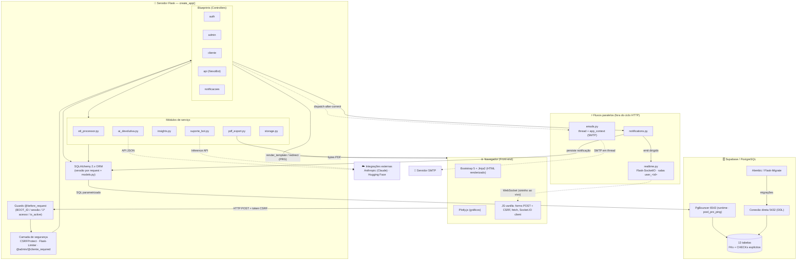
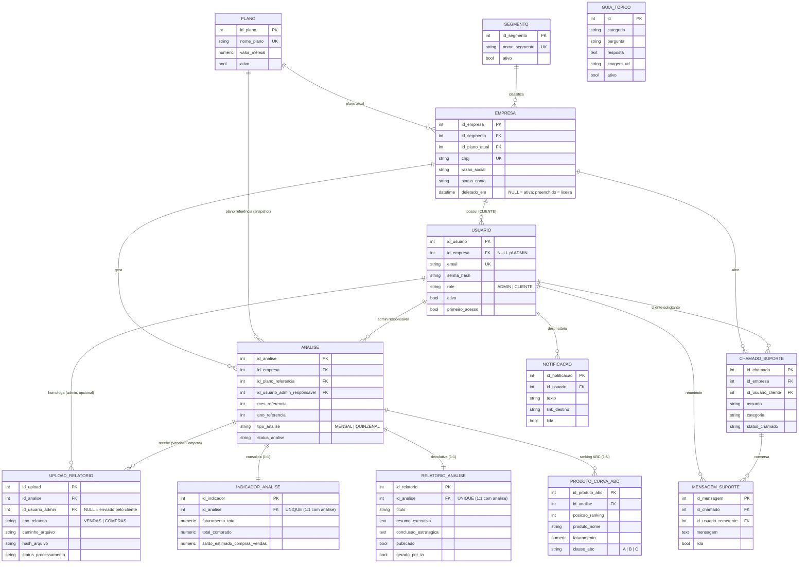

# Relatório Técnico — NEXO · Faturamento Inteligente

> **Resumo do produto.** O NEXO é uma plataforma web de consultoria de faturamento para o varejo. Lojistas (clientes) enviam relatórios brutos de Vendas e Compras exportados de seus PDV/ERP; o sistema processa esses dados via um motor de ETL, consolida indicadores honestos (sem inferir lucro/margem/CMV), aplica o Princípio de Pareto (Curva ABC) e entrega ao cliente uma **devolutiva estratégica** — texto executivo gerado por IA mais um painel visual de semáforos de risco. A operação é mediada por um consultor (admin) que homologa os dados e publica a análise.

---

## 1. Arquitetura do Projeto

### 1.1. Padrão arquitetural

O NEXO adota o padrão **MVC (Model–View–Controller)** sobre o microframework Flask, implementado com **App Factory + Blueprints** — a forma idiomática de estruturar aplicações Flask de médio porte com separação clara de responsabilidades:

- **Model** — centralizado em `models.py`, com **13 entidades** mapeadas via SQLAlchemy 2.x (estilo declarativo tipado, `Mapped`/`mapped_column`). É a única fonte de verdade do esquema de dados.
- **View** — a camada de apresentação são os **38 templates Jinja2** (organizados em `templates/{admin,cliente,auth,emails}` + raiz), renderizados no servidor e estilizados por um *design system* próprio (`static/css/nexo.css`) sobre o Bootstrap 5.
- **Controller** — os **Blueprints** em `blueprints/`, cada um encapsulando um contexto de negócio: `auth`, `admin`, `cliente`, `api` e `notificacoes`.

O ponto de entrada é a função-fábrica `create_app()` em `app.py`, que instancia a aplicação, carrega a configuração por ambiente, inicializa as extensões, registra os blueprints e os *guards* globais. Esse padrão elimina importações circulares (as extensões nascem "vazias" em `extensions.py` e são vinculadas à app dentro da fábrica) e viabiliza múltiplos ambientes e testes isolados.

### 1.2. Fluxo de dados (Front-end → Back-end → Banco)

```
  Navegador (Bootstrap 5 + Plotly.js + JS vanilla)
        │  HTTP (forms POST com token CSRF) / WebSocket / fetch JSON
        ▼
  Flask (Blueprints = Controllers)   ── guards @before_request (sessão, 1º acesso)
        │                            ── decorators @admin_required / @cliente_required
        │  ORM SQLAlchemy 2.x (sessão por request)
        ▼
  Supabase / PostgreSQL              ── PgBouncer 6543 (runtime, pool_pre_ping)
        │                            ── conexão direta 5432 (DDL/migrações Alembic)
        ▼
  Persistência relacional (13 tabelas, FKs e CHECKs explícitos)
```

O fluxo típico de uma requisição: o navegador envia um `POST` de formulário (sempre acompanhado de **token CSRF**); o blueprint correspondente valida permissão e dados, manipula entidades via a sessão do SQLAlchemy e confirma a transação (`commit`); a resposta volta como um template Jinja renderizado ou um redirect (padrão **Post/Redirect/Get**). Para dados ricos de gráfico, o controller serializa estruturas Python que o template injeta como JSON consumido pelo **Plotly.js** no cliente.

Dois canais complementam o ciclo HTTP tradicional:

- **Tempo real (WebSocket):** o `realtime.py` usa Flask-SocketIO. Cada usuário autenticado entra em uma **sala exclusiva** (`user_<id>`) no handshake (autenticado pelo mesmo cookie de sessão), e as notificações do "sininho" são emitidas de forma **direcionada**, nunca em broadcast. As origens do handshake são restritas por configuração (mitiga *Cross-Site WebSocket Hijacking*).
- **E-mails transacionais assíncronos:** o `emails.py` dispara o SMTP em uma *thread* com `app_context` próprio, para não bloquear a requisição; é *fail-safe* (se não há credenciais, o envio é suprimido sem quebrar o fluxo).

### 1.3. Persistência e estratégia de banco

O banco de produção é **PostgreSQL gerenciado pelo Supabase**. A configuração (`config.py`) distingue dois modos de conexão, resolvidos dinamicamente:

- **Runtime da aplicação** → conexão *pooled* (PgBouncer, porta 6543), com `pool_pre_ping=True` e `pool_recycle` para sobreviver ao fechamento de conexões ociosas pelo pooler.
- **DDL / migrações** → conexão **direta** (porta 5432), ativada por `NEXO_DB_DIRECT=1`, pois o PgBouncer em modo transação é incompatível com operações de esquema.

O versionamento de esquema é feito com **Alembic** (via Flask-Migrate) — há **6 migrações** versionadas, cada alteração de schema (ex.: a coluna `deletado_em` da Lixeira) sendo uma revisão encadeada e reversível.

### 1.4. Modularidade e camadas transversais

Além dos blueprints, a lógica de negócio pesada foi extraída para **módulos de serviço** desacoplados das rotas, o que mantém os controllers enxutos e o domínio testável:

| Módulo | Responsabilidade |
|---|---|
| `etl_processor.py` | Motor de ETL (leitura, normalização, KPIs, Curva ABC) |
| `ai_devolutiva.py` | Geração da devolutiva por IA + fallback determinístico |
| `insights.py` | Conversão de KPIs em cards-semáforo (5W2H) |
| `suporte_bot.py` | NexoBot (assistente de suporte) |
| `pdf_export.py` | Exportação da análise em PDF |
| `notifications.py` | Criação de notificações + emissão WebSocket |
| `emails.py` | E-mails transacionais SMTP assíncronos |
| `storage.py` | Ponto único de I/O de arquivos (abstração de storage) |

Essa fronteira é deliberada: o `etl_processor`, por exemplo, recebe a sessão do banco por parâmetro e **não controla a transação nem decide status de negócio** — quem orquestra é o controller. Isso torna o motor reutilizável e o comportamento transacional previsível.

### 1.5. Segurança como camada de arquitetura

A segurança não é pontual, e sim transversal, aplicada em `@before_request` e por *decorators*:

- **Autenticação/sessão:** Flask-Login com PK customizada; cookie de sessão `HttpOnly` + `SameSite=Lax`; um **`BOOT_ID`** carimba a sessão a cada boot do servidor — qualquer restart invalida logins antigos. O *guard* de sessão também derruba na hora um usuário **desativado** (revalidação de `is_active`).
- **Autorização:** `@admin_required` e `@cliente_required` segregam os dois perfis; rotas de cliente checam **isolamento multi-tenant** (a análise/chamado tem de pertencer à empresa do usuário).
- **CSRF:** `Flask-WTF CSRFProtect` global — todos os formulários mutáveis carregam token, e chamadas `fetch` enviam o header `X-CSRFToken`.
- **Rate limiting:** `Flask-Limiter` trava brute force no login e abuso na recuperação de senha.
- **Tokens temporários:** `itsdangerous` (assinados, expiração de 15 min) para ativação de conta e redefinição de senha.

---

## 2. Tecnologias e Bibliotecas

### 2.1. Núcleo web e dados

| Tecnologia | Papel no ecossistema NEXO |
|---|---|
| **Flask 3** | Microframework web; base do padrão App Factory + Blueprints. |
| **Jinja2** | Motor de templates (renderização server-side das views, herança de layout via `base.html`). |
| **Werkzeug** | Camada WSGI sob o Flask; também fornece *hashing* de senha (`generate/check_password_hash`) e `secure_filename`. |
| **Flask-SQLAlchemy / SQLAlchemy 2.x** | ORM. Mapeamento declarativo tipado das 13 entidades; todas as consultas usam `select()` parametrizado (zero SQL cru → imune a SQL injection). |
| **Flask-Migrate / Alembic** | Versionamento e evolução incremental do esquema PostgreSQL (migrações reversíveis). |
| **psycopg2** | Driver PostgreSQL que conecta o SQLAlchemy ao Supabase. |
| **python-dotenv** | Carga de variáveis de ambiente (`.env`) — segredos e URLs fora do código. |

### 2.2. Tempo real, comunicação e segurança

| Tecnologia | Papel |
|---|---|
| **Flask-SocketIO + simple-websocket** | Notificações em tempo real (sininho ao vivo) por salas de usuário; modo `threading`, estável no Python 3.12 sem eventlet/gevent. |
| **Flask-Mail** | E-mails HTML transacionais (boas-vindas, publicação de análise, ticket resolvido, recuperação de senha) via SMTP. |
| **Flask-WTF** | Proteção CSRF global. |
| **Flask-Limiter** | Rate limiting por IP em rotas sensíveis. |
| **itsdangerous** | Geração/validação de tokens assinados e temporizados (ativação de conta, reset de senha). |

### 2.3. Processamento de dados e Inteligência

| Tecnologia | Papel |
|---|---|
| **pandas** | Espinha dorsal do ETL: leitura tolerante a sujeira, normalização, agregações vetorizadas e cálculo da Curva ABC (Pareto via `cumsum`/`np.select`). |
| **openpyxl** | Leitura dos arquivos `.xlsx` exportados dos PDV. |
| **anthropic (Claude)** | SDK oficial para gerar a devolutiva estratégica (modelo `claude-opus-4-8`), com saída em JSON estruturado e *system prompt* rígido. |
| **httpx** | Cliente HTTP que consome a Inference API gratuita da Hugging Face no NexoBot (caminho opcional). |
| **reportlab** | Geração do PDF profissional da análise executiva (platypus: tabelas, semáforos, Curva ABC). |

### 2.4. Front-end (via CDN, sem etapa de build)

**Bootstrap 5** (grid, componentes e modais), **Bootstrap Icons**, **Plotly.js** (gráficos interativos: comparativo Compras×Vendas, Pareto da Curva ABC, série histórica) e **JavaScript vanilla** para interações pontuais (busca client-side, *modais* de confirmação, chat do bot, atualização do sininho via socket). A opção por CDN mantém o projeto sem *toolchain* de front-end, coerente com o porte de um MVP/TCC.

---

## 3. Principais Funcionalidades

### 3.1. Painel do Admin (consultor NEXO)

É o centro operacional, protegido por `@admin_required`. Concentra:

- **Dashboard analítico** — KPIs da carteira (empresas ativas/suspensas/canceladas, receita mensal estimada por plano) e uma **fila de homologação**: análises com anexos enviados pelo cliente aguardando validação.
- **Gestão de Empresas (CRUD)** — cadastro de empresa cliente + usuário CLIENTE vinculado. No cadastro, **não se gera senha provisória**: o sistema cria a conta inativa e dispara um e-mail com **link seguro de definição de senha** (token de 15 min).
- **Gestão de Análises** — abertura de análises (mensal/quinzenal, com regras de negócio por plano), upload dos relatórios, disparo do ETL e o **editor de devolutiva**.
- **Suporte (tickets)** — painel central de chamados de todas as empresas, agrupados por status, com resposta e mudança de estado.
- **Base de Conhecimento (CMS)** — CRUD dos tópicos do "Guia", incluindo upload de imagens. É a **fonte única** que alimenta tanto a aba Guia do cliente quanto o NexoBot (princípio DRY).

### 3.2. Fluxo do Cliente (lojista)

Protegido por `@cliente_required` e por **isolamento multi-tenant** (todo acesso é filtrado pela empresa do usuário):

1. **Onboarding self-service** — o cliente anexa seus relatórios de Vendas e Compras nas análises abertas. Os uploads nascem com `id_usuario_admin = NULL` (aguardando homologação) e notificam os admins.
2. **Dashboard** — exibe a última devolutiva publicada: KPIs, gráficos Plotly (comparativo, Pareto, histórico temporal), os **semáforos de risco** e um bloco de **auditoria de origem** (qual arquivo e período embasaram a análise).
3. **Histórico e detalhe** — lista de análises concluídas e a visão individual de cada uma, com **exportação em PDF**.
4. **Suporte** — abertura e acompanhamento de chamados, mais o **NexoBot** e a aba **Guia**.

Regra de visibilidade inegociável: o cliente só enxerga análises em status `CONCLUIDO` **e** com `relatorio.publicado = True` — a publicação é uma decisão humana do consultor, nunca automática.

### 3.3. Sistema de Lixeira em Dois Estágios (Soft + Hard Delete)

Inspirado no modelo Google Drive/Windows, separa exclusão reversível de exclusão definitiva:

- **Estágio 1 — Soft Delete (mover para a lixeira):** a exclusão de uma empresa apenas carimba a coluna `deletado_em` e **desativa os usuários** vinculados (bloqueando o login). Todas as listagens normais filtram `deletado_em IS NULL`, então o cliente "some" sem que nada seja apagado. É **reversível**: a restauração limpa `deletado_em` e reativa os usuários, trazendo todo o histórico intacto.
- **Estágio 2 — Hard Delete (exclusão permanente):** só atua sobre empresas **já na lixeira** (duplo passo de segurança). Executa uma **deleção em cascata manual e ordenada** (Curva ABC → uploads + arquivos físicos → indicadores → relatórios → análises → mensagens → chamados → notificações → usuários → empresa), tudo em **uma transação** com `try/except` e *rollback* atômico.

O fluxo é todo `POST` protegido por CSRF, com **modais de confirmação** estilizados (aviso crítico e irreversível no hard delete).

### 3.4. Processador de ETL

O coração analítico (`etl_processor.py`) é um **motor universal** que não assume layout fixo de planilha — lida com a heterogeneidade real dos relatórios de PDV em 4 camadas:

1. **Leitura crua e tolerante** — lê `.xlsx`/`.csv` sem assumir cabeçalho, tentando múltiplos *encodings* e separadores; sobrevive a lixo decorativo, quebras de página e marcas d'água.
2. **Detecção dinâmica de cabeçalho** — varre as primeiras linhas e mapeia colunas por **substring normalizada** contra um dicionário de *aliases* (independe de posição e do nome exato; trata até cabeçalho composto em duas linhas).
3. **Consolidação de KPIs** — faturamento total, volume comprado, **Indicador de Pressão de Estoque** (descasamento compras×vendas), produto mais vendido, maior faturamento e maior saldo parado.
4. **Curva ABC (Pareto)** — classificação A/B/C vetorizada sobre o faturamento acumulado.

A **regra de ouro do projeto** está cravada aqui: o ETL detecta colunas como "lucro" e "custo" apenas para **mapeamento defensivo** e as **descarta** — o NEXO trabalha somente com faturamento, volume de compras e descasamento estimado, **jamais** lucro, margem, CMV ou rentabilidade (que o dado bruto do PDV não sustenta). DataFrames vivem só em memória; apenas os KPIs finais são persistidos, e o status `CONCLUIDO` nunca é definido pelo ETL — é decisão humana.

### 3.5. Módulo de IA (Devolutivas)

O `ai_devolutiva.py` gera o "Resumo Executivo" e a "Conclusão Estratégica" a partir do resumo estatístico da análise, eliminando digitação manual. Características de engenharia:

- **Provider:** Claude (Anthropic), com saída forçada em **JSON estruturado** (json_schema) e *system prompt* que proíbe explicitamente os termos vetados.
- **Auditoria de saída:** mesmo com o prompt blindado, o texto retornado é **revalidado** contra a lista de termos proibidos; se contiver qualquer um, é **descartado**.
- **Fail-safe determinístico:** sem chave de API, em erro, recusa ou falha de auditoria, o sistema cai num **gerador local** que constrói um texto honesto a partir dos mesmos números — nunca quebra. Uma flag `fonte` (`ia`/`fallback`) deixa a interface honesta sobre a origem.

Complementarmente, o `insights.py` traduz os mesmos KPIs em **cards-semáforo (5W2H reduzido)** — crítico/atenção/oportunidade —, derivados do dado (não do texto), o que substitui a "muralha de texto" por uma síntese visual acionável.

### 3.6. Bot de Suporte (NexoBot)

Assistente de chat (`suporte_bot.py`) restrito ao **uso do portal**, com a mesma filosofia *fail-safe* da IA:

- **Caminho primário (opcional):** se houver token, consulta a Inference API gratuita da Hugging Face, alimentando o modelo com a Base de Conhecimento como contexto. A resposta passa por **auditoria de escopo** (termos proibidos/vazia → descartada).
- **Fallback determinístico:** sempre disponível, pontua os tópicos da Base de Conhecimento por **interseção de palavras-chave** e devolve o mais relevante; trata saudações e pedidos de atendimento humano (orientando a abrir chamado). O bot **nunca fica mudo**.

Como bot e aba Guia leem da **mesma tabela** (`guia_topico`, gerenciada pelo admin no CMS), a base de respostas é única e mantida sem alterar código.

---

## Considerações finais

O NEXO demonstra maturidade de engenharia incomum para um MVP acadêmico: separação de camadas limpa, disciplina transacional explícita, *fail-safes* em todos os pontos de integração externa (IA, SMTP, WebSocket, HF), uma postura de segurança defensiva em profundidade e — sobretudo — uma **regra de domínio inegociável** (a recusa em inventar lucro/margem/CMV) reforçada redundantemente no ETL, na IA e nos semáforos. A arquitetura modular deixa o caminho de evolução evidente: trocar o storage local por object storage (já isolado em `storage.py`) e escalar horizontalmente atrás de um WSGI de produção com WebSocket.

---

## 4. Diagrama de Arquitetura e Fluxo de Dados

O diagrama abaixo ilustra o ciclo principal de requisição (Navegador → Flask → SQLAlchemy → Supabase) e os dois fluxos paralelos que escapam do ciclo HTTP síncrono: o canal **WebSocket** (`realtime.py`) e o disparo **assíncrono de e-mails em thread** (`emails.py`).



---

## 5. Diagrama do Modelo de Dados (DER)

O diagrama entidade-relacionamento mapeia as **13 entidades** de `models.py` e suas chaves estrangeiras. As FKs destacadas são exatamente as que determinam a **ordem da exclusão em cascata manual** do Hard Delete (Estágio 2 da Lixeira): como não há `ON DELETE CASCADE` no banco (controle explícito do que sai), os filhos são removidos antes dos pais, de baixo para cima na hierarquia `EMPRESA → ANALISE/CHAMADO → (indicadores, curva, uploads, mensagens) ` e `USUARIO → NOTIFICACAO`.



> **Nota sobre `GUIA_TOPICO`:** é uma entidade **independente** (sem FK) — funciona como base de conhecimento do CMS, consumida tanto pela aba Guia do cliente quanto pelo NexoBot. Por não ter dependências, não participa da cascata de exclusão.

> **Nota sobre a ordem da cascata (Hard Delete):** removendo uma `EMPRESA`, a sequência segura é `PRODUTO_CURVA_ABC → UPLOAD_RELATORIO → INDICADOR_ANALISE → RELATORIO_ANALISE → ANALISE`, depois `MENSAGEM_SUPORTE → CHAMADO_SUPORTE`, depois `NOTIFICACAO → USUARIO` e, por fim, a própria `EMPRESA`. Essa é exatamente a ordem topológica inversa das FKs ilustradas acima.
